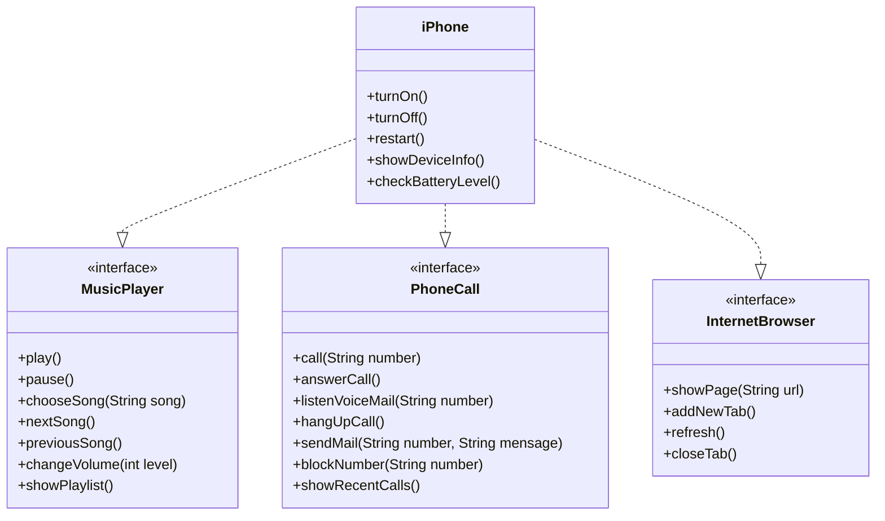

# Java Básico DIO - Modelagem de um componente iphone
Terceiro projeto do bootcamp de java da plataforma DIO. Este é um estudo sobre modelagem de classes utilizando o uml. A modelagem se baseia no primeiro iphone, apresentado em conferência em 2007.

## Modelagem 

